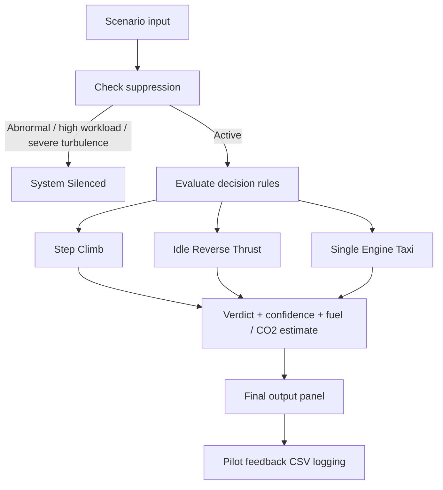

# <div align="center">Aero DSS</div>

<div align="center">


**Sustainable Flight Operations Decision Support System**

[](https://www.python.org/)
[](https://pyinstaller.org/)
[](https://www.microsoft.com/windows)
[]()

</div>

---

## ✈️ Overview

Aero DSS is a compact aviation decision-support demo that evaluates operational scenarios and presents sustainability-oriented recommendations.

It supports:

- 🎯 `Step Climb / Altitude Optimization`
- 🛬 `Idle Reverse Thrust`
- 🛫 `Single Engine Taxi`

The application includes:

- 🖥️ a modern Qt GUI
- ⌨️ a CLI fallback
- 🧾 CSV logging for pilot feedback
- ♻️ estimated fuel saving and CO2 prevented outputs
- 📦 a one-file Windows executable

---

## ✨ Visual Highlights

<table>
  <tr>
    <td width="50%">
      <strong>Decision cards</strong><br>
      Icon-led verdict badges, confidence bars, and sustainability metrics.
    </td>
    <td width="50%">
      <strong>Final output panel</strong><br>
      Applied actions are summarized with estimated fuel saving and CO2 prevented.
    </td>
  </tr>
</table>

---

## 🔎 Key Features

- ✅ **Context-aware evaluation**
  - Uses flight phase, workload, runway, weather, traffic, and SOP inputs.
- ♻️ **Sustainability output**
  - Shows estimated fuel saving and CO2 prevented in both GUI and CLI.
- 🧭 **Clear verdicts**
  - `Recommended`, `Conditional`, `Not Recommended`, and `System Silenced`.
- 🪪 **Pilot feedback logging**
  - Saves applied / not suitable / ignored feedback into CSV.
- 🎨 **Polished UI**
  - Card-based layout, icon badges, and a dedicated final output section.
- 📦 **One-file EXE**
  - Ready-to-run Windows build is included in the repository.

---

## 🧩 Decision Logic



---

## 🎛️ User Flow

1. 🧠 Enter flight scenario details
2. 🧪 Review the context summary
3. ⚙️ Run the evaluation
4. 📊 Inspect verdict cards and metrics
5. ✅ Log an `Applied` action if relevant
6. ♻️ Review the final output summary

---

## 📁 Included Files

- `main.py` - application source
- `AeroDSS.spec` - PyInstaller build spec
- `assets/app.png` - app icon / branding image
- `dist/AeroDSS.exe` - Windows one-file executable

---

## 🚀 Run the App

### From source

```bash
python main.py
```

### CLI mode

```bash
python main.py --cli
```

### Windows executable

```text
dist/AeroDSS.exe
```

---

## 🛠️ Build

To rebuild the executable:

```bash
python -m PyInstaller --onefile --noconfirm --clean --name AeroDSS --windowed --icon assets\app.png --add-data=assets:assets --exclude-module=PySide6 main.py
```

---

## 📌 Output Metrics

- ⛽ **Estimated fuel saving**
- ♻️ **CO2 prevented**
- 🎯 **Average confidence**
- 🧾 **Pilot log status**

---

## 📸 Branding

<p align="center">
  
</p>

---

## 📝 Notes

- The executable is tracked in the repository for easy access.
- Release tags are available on GitHub:
  - `v1.0.0` source release
  - `v1.0.1` binary release marker
- The application is designed as a demo and does not replace operational procedures or pilot judgment.

---

## 🤝 License / Usage

This repository is intended for internal/demo use unless otherwise specified by the project owner.
